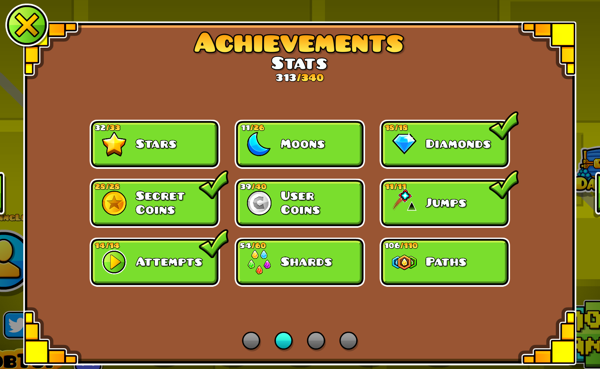
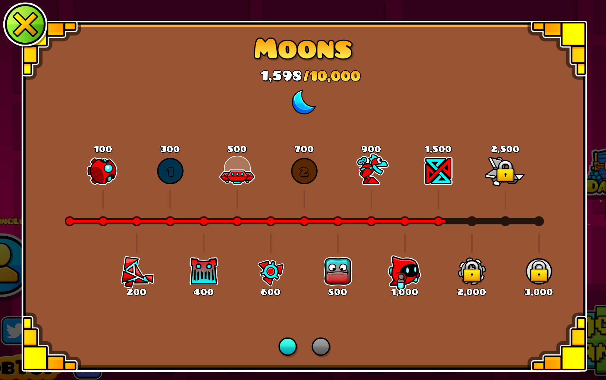
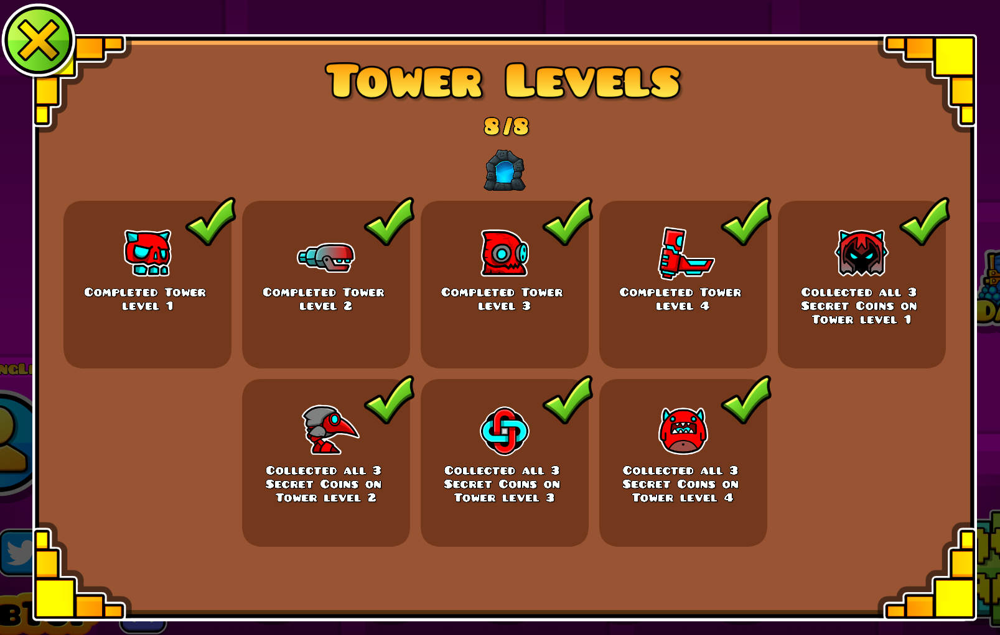
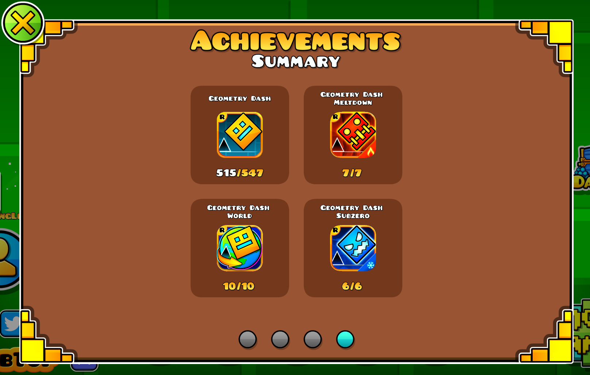

# Achievement Tracker

A fork of **Achievements Reimagined** (by TheRisingLegend) that adds achievement tracking, progress notifications, and a comprehensive tracking dashboard.

## Features

- Complete redesign of the achievements menu with a cleaner, category-based layout.
- **38+ achievement categories** organized across 3 pages: Levels, Stats, and Other.
- **Tracking system** — right-click any achievement to track it, and view all tracked achievements in the dedicated Tracking tab.
- **Tracking dashboard** — 2-column quest-card UI with progress bars, percentage, and checkboxes for quick toggle.
- **Summary page** — optional overview showing overall progress at a glance.
- **Better secret descriptions** — reveals vault codes and hints when enabled.
- **12+ customizable settings** — player colors, progress bars, category counts, show secrets, and more.

## Settings

| Setting | Description |
|---|---|
| Use Player Colors | Use your player colors for progress bars and icons |
| Summary Page First | Show the summary page first when opening the achievements menu |
| Hide Category Progress Counts | Hide the counts on each category button |
| No Progress Bars | Show all achievements with individual boxes instead of progress bars |
| Show Secrets | Reveal vault codes and hints for secret achievements |
| Show Uncompleted First | Sort uncompleted achievements before completed ones |

## Incompatibilities

- `limegradient.betterachievements` (breaking)

## Credits

- **TheRisingLegend**: Original Achievements Reimagined mod.
- **GlowRock**: Inspiration and coding help from Better Unlock Progression.
- **GD Wiki**: Better descriptions for secret and vault achievements.

## Reporting Bugs

If you find any bugs or have a suggestion, please open an issue on [GitHub](https://github.com/TheRisingLegend/achievements-reimagined).

## Previews

